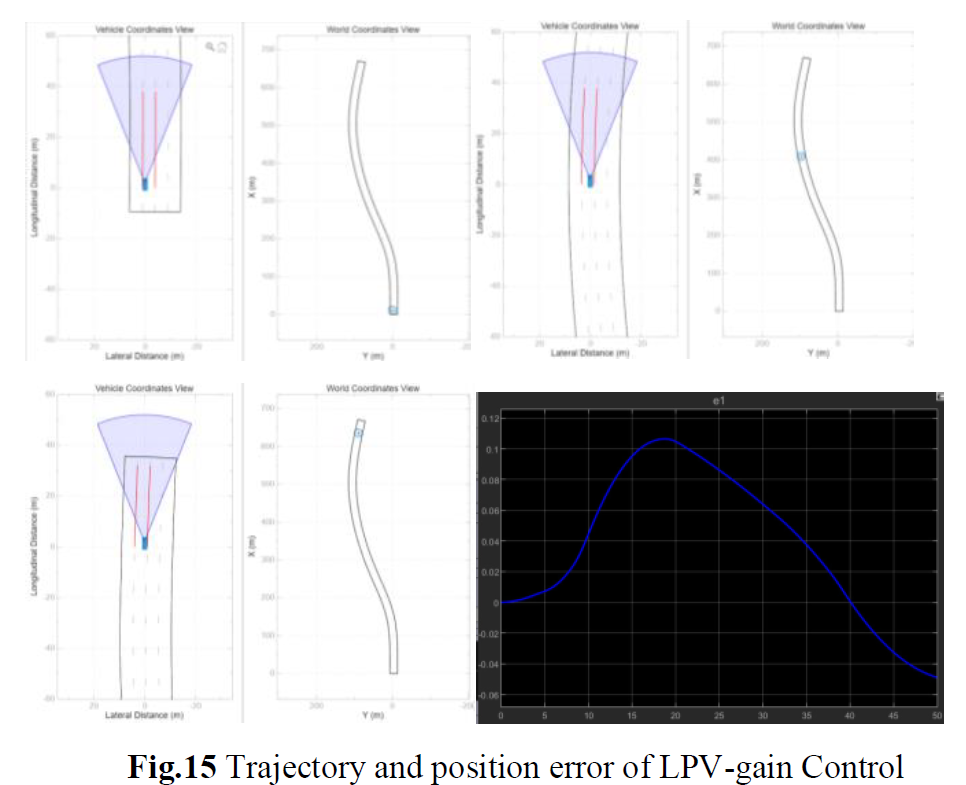

# Lane-Keeping-Autonomous-driving

Code developed for "S. Sanchez, - Active Steering Control for Lane Keeping using Automated Driving Toolbox ".  
Master's graduate "Calabria University".  
For any questions or suggestions write to sofysan.1993@gmail.com

# Sumary.
This paper presents a comprehensive study on control strategies for addressing positioning errors in vehicle lane-keeping applications. The primary objective is to develop effective control techniques that can minimize the vehicle's positional error and ensure accurate lane keeping. Four control strategies, namely **𝑯∞** optimal control, **𝑯𝟐** optimal control, **𝑳𝟏** optimal control, and LPV gain schedule control were developed. To evaluate the effectiveness and performance of each control strategy in mitigating positioning errors and achieving robust and accurate lane-keeping capabilities were used simulations based on MATLAB/Simulink and Automated Driving Toolbox.

  

# Prerequisites
- The code was created and tested on the Matlab/Simulink 2023a environment

# File description
The repository contains two main files to run the project.  

1. **Paper**: This contains the explanation of the complete process, the mathematical formulations, and the control configuration.

2. **Code**: This file contains all the necessary MATLAB/Simulink programs

# Example to run the experiment  

### Matlab/Simulink simulation 
1. Download the files.
2. Run the matlab program **init**
3. Run the simulink model **Line_keeping**

**Note**: This projec is tested using Automated Driving Toolbox, then in order to see the results use The Bird's-Eye Scope

  

